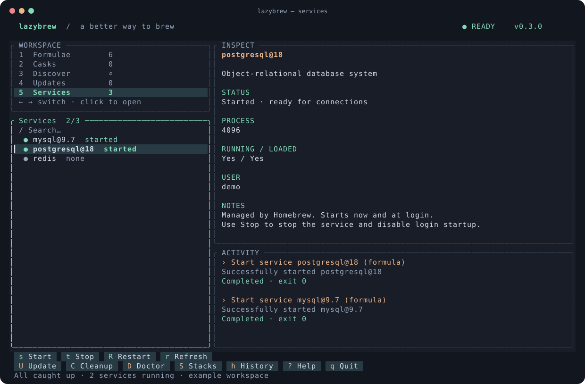

<div align="center">

# LazyBrew

**Homebrew, at your fingertips.**

A fast terminal workspace for packages and services on macOS.<br>
Keyboard first. Mouse friendly. Written in Rust.

[](https://github.com/wagnerfnds/LazyBrew/actions/workflows/ci.yml)
[](LICENSE)
[](#installation)



*The real interface rendered with fictional demo data. No personal machine data.*

</div>

Inspired by the workflow of [lazygit](https://github.com/jesseduffield/lazygit) and
[lazydocker](https://github.com/jesseduffield/lazydocker), independently implemented
for Homebrew. Early-stage software; contributions and feedback are welcome.

## Why LazyBrew?

- **One workspace:** installed formulae, casks, available packages, updates and services.
- **Mouse support:** click workspaces, select rows, focus panels and use action buttons.
  The scroll wheel targets the panel under your pointer.
- **Instant navigation:** event-driven input, persistent scroll position and immediate
  local previews. Details load automatically after a short debounce and are cached.
- **Live activity:** stdout, stderr and command results appear without blocking navigation.
- **Deliberate changes:** install, remove, upgrade, pin/unpin, start, stop and restart
  all use a confirmation dialog. Homebrew update, cleanup and doctor are included.
- **Homebrew as the backend:** official CLI and structured JSON, no Ruby internals.

## Installation

Requirements: macOS, [Homebrew](https://brew.sh/), an interactive terminal supporting
true color and mouse reporting, and a recent [stable Rust toolchain](https://rustup.rs/).
Apple Silicon and Intel Homebrew paths are detected automatically.

Install directly from this repository:

```sh
cargo install --git https://github.com/wagnerfnds/LazyBrew.git --locked
lazybrew
```

Or build locally:

```sh
git clone https://github.com/wagnerfnds/LazyBrew.git
cd LazyBrew
cargo run --release --locked
```

Cargo installs the executable into `~/.cargo/bin`; add that directory to your PATH
if necessary. There is currently no published Homebrew tap or crates.io release.

## Get comfortable

The left side is your workspace and package list. **Inspect** follows your selection.
**Activity** keeps command output visible. A mint border marks the focused panel.
Buttons at the bottom are clickable and show their keyboard shortcut.

| Input | Action |
| --- | --- |
| `1`–`5`, `←` / `→` | Switch workspace |
| `Tab` / `Shift-Tab` | Focus list, details or activity |
| `j` / `k`, `↑` / `↓` | Navigate or scroll the focused panel |
| `PgUp` / `PgDn` | Scroll a page in the focused panel |
| `Home` / `End` | First/last item; activity start/live tail |
| Click / mouse wheel | Select, focus, activate buttons / scroll |
| `/` | Filter locally; in Discover, press Enter to search Homebrew |
| `Enter` | Reload selected details |
| `i` | Install a Discover result |
| `x` / `u` | Remove / upgrade an installed package |
| `p` | Pin/unpin an installed formula |
| `s` / `t` / `R` | Start / stop / restart a service |
| `U` / `C` / `D` | Homebrew update / cleanup / doctor |
| `r` | Refresh data |
| `Esc` | Clear the filter or cancel a confirmation |
| `?` | Help |
| `q` / `Ctrl-C` | Quit when no operation is running |

Select **Confirm** or press `y` to execute an operation; **Cancel**, `n` or `Esc`
backs out. One operation runs at a time. Normal exit is blocked while it runs.

If your terminal intercepts mouse input, check its mouse-reporting settings. Most
terminals allow selecting/copying text while holding a modifier such as Shift;
the exact modifier depends on your terminal.

## Example: MySQL 9 and PostgreSQL 18

These examples set up **new local development databases**. They are not a migration
procedure for existing database directories. Read each formula's caveats and back
up existing databases before changing their major version.

### From LazyBrew

1. Open **Discover** (`3`), press `/`, type `mysql@9.7`, then Enter.
2. Select the formula, click **Install** or press `i`, and confirm.
3. Repeat for `postgresql@18`.
4. Open **Services** (`5`). Select either service and click **Start**, **Stop** or
   **Restart** (`s`, `t`, `R`). Confirm the action and watch **Activity**.
5. Service status refreshes after the command. Use `r` whenever you need a fresh view.

The pinned formula name matters: **`mysql@9.7` installs MySQL 9**, while unversioned
`mysql` follows Homebrew's current default and may install a different major version.
See the official [MySQL 9 formula](https://formulae.brew.sh/formula/mysql@9.7) and
[PostgreSQL 18 formula](https://formulae.brew.sh/formula/postgresql@18).

### Equivalent Homebrew commands

Install and start:

```sh
brew install mysql@9.7 postgresql@18
brew services start mysql@9.7
brew services start postgresql@18
brew services list
```

Restart or stop a service:

```sh
brew services restart mysql@9.7
brew services restart postgresql@18

brew services stop mysql@9.7
brew services stop postgresql@18
```

Without `sudo`, Homebrew manages these services for your user. `start` starts the
service and registers it to launch at login; `stop` stops and unregisters it.
[Homebrew service documentation](https://docs.brew.sh/Manpage#services-subcommand).

### Connect and finish setup

With the services running, initialize MySQL's security settings in your regular
terminal. Homebrew's fresh MySQL installation initially has no root password:

```sh
"$(brew --prefix mysql@9.7)/bin/mysql_secure_installation"
"$(brew --prefix mysql@9.7)/bin/mysql" -u root -p
```

Connect to PostgreSQL's default `postgres` database using its versioned client:

```sh
"$(brew --prefix postgresql@18)/bin/psql" -d postgres
```

These full paths work on both Apple Silicon and Intel and avoid requiring
`brew link --force`. Use the default local socket for PostgreSQL; a fresh Homebrew
cluster normally uses your macOS username as the initial role. Run interactive
setup programs outside LazyBrew. See each formula's linked caveats for details.

## Configuration

```sh
lazybrew --help
lazybrew --brew-path /opt/homebrew/bin/brew
lazybrew --config config.example.toml
```

```toml
brew_path = "/opt/homebrew/bin/brew" # Intel: /usr/local/bin/brew
max_output_lines = 2000
```

The optional default config on macOS is
`~/Library/Application Support/dev.LazyBrew.LazyBrew/config.toml`.
Daily logs live under `logs/` in the application's data directory.
`RUST_LOG=lazybrew=debug` enables query diagnostics. Logs stay local; LazyBrew has
no telemetry. Homebrew retains its own settings and network behavior.

Mouse support is enabled while LazyBrew runs and restored on normal exit or panic.
Recommended terminal size: **100 × 30** or larger; minimum: **60 × 18**.

## Architecture

```text
src/
  main.rs           terminal lifecycle, event-driven input, CLI, logging
  app.rs            application state, focus, actions, detail cache
  ui.rs             rendering and mouse hit targets
  domain.rs         validated identifiers, packages, services, operations
  config.rs         TOML configuration
  backend/
    mod.rs          BrewBackend contract
    cli.rs          Homebrew CLI adapter
    parser.rs       typed wire models → domain objects
    runner.rs       subprocesses, query timeouts, bounded streaming
```

The UI never builds shell commands. Operations are a typed enum passed through
`BrewBackend`; the CLI adapter uses `Command::new(...).args(...)`. Package identifiers
reject flags, paths and shell metacharacters. Formula and cask operations specify
their kind explicitly. Structured reads use official JSON; `brew search` is the
isolated text-only exception.

Input wakes the UI directly through a channel. There is no keyboard polling delay
or idle redraw loop. Detail queries wait 120 ms after selection, cancel on navigation,
and use a 64-entry in-memory cache. Channels and activity history are bounded.
Queries time out after 60 seconds; package operations do not have an arbitrary deadline.

## Development

```sh
cargo fmt --check
cargo clippy --locked --all-targets -- -D warnings
cargo test --locked
cargo build --release --locked
python3 scripts/smoke.py
```

Tests use sanitized JSON fixtures and fake subprocesses, without an installed
Homebrew or changes to real packages. The PTY smoke test checks actual mouse reporting,
automatic details, confirmation cancellation, search, help and terminal restoration.
Python 3 and Unix are needed for subprocess/PTY tests. CI runs on macOS and Linux;
macOS is the supported application platform.

Regenerate the preview from fictional data:

```sh
cargo run --example preview
```

See [CONTRIBUTING.md](CONTRIBUTING.md) for contribution guidelines and
[SECURITY.md](SECURITY.md) for private vulnerability reporting.

## Current limits and roadmap

- Interactive password/sudo prompts belong in your regular terminal; child stdin is closed.
- Operations cannot currently be cancelled from the UI.
- Discovery uses Homebrew search; it is not an offline catalogue.
- Refresh is manual or follows an operation. Automatic background refresh is not implemented.
- No persistent cache or operation history yet.
- Switching active PHP/Node/PostgreSQL versions and development stacks are planned.

## License

[MIT](LICENSE). Independent project; not affiliated with Homebrew, lazygit or lazydocker.
